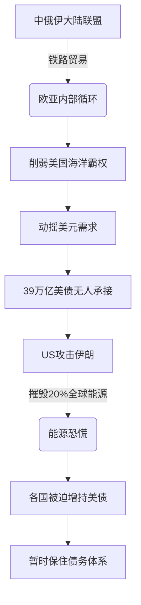

# Game Theory 28 Predictive History

> [!summary] 课程总结
> 本文从[[博弈论]]视角分析，本讲回顾整个学期的核心问题：**美国为何攻击伊朗？** 围绕这一谜题，课程提出了三大解释框架，并深入剖析了**地缘[[政治]]**视角——中俄伊大陆联盟对美国海洋霸权和债务融资体系的致命威胁，是理解当前战争与停火谈判困境的关键。

## 核心问题
- 学期驱动问题：**Why did the US attack Iran?**
- 时至今日，特朗普仍未能给出明确理由，这本身构成了核心谜题。
- 只有正确诊断战争根源，才能理解**停火谈判**的难度。

## 三大解释框架
1. **地缘[[政治]]（Geopolitics）** – 阻止中俄伊大陆联盟，保卫美元债务体系。
2. *（第二个原因未在讲座中展开）*
3. *（第三个原因未在讲座中展开）*

---

## 详解：地缘政治解释

### 中俄伊大陆联盟的威胁
- 美国最担忧的是 **[[俄罗斯]] – [[伊朗]] – [[中国]]** 结成**大联盟**。
- 三国若彼此贸易，可覆盖整个**欧亚大陆**，包括欧洲、中东产油国（GCC）、非洲、[[印度]]。
- 中国修建的铁路网将使联盟绕过**美国的海权控制**，形成闭环贸易圈。

> [!warning] 债务与霸权的命脉
> 美国当前背负 **39 万亿美元国债**，唯一维持债务的方式是**强迫其他国家持续购入美国国债**。
> 
> 如果中俄伊联盟成功脱离美元结算体系，美债需求崩塌，将直接引爆美国的财政危机。

### 攻击伊朗的杠杆效应
- 攻击伊朗可以直接打掉全球 **至少 20% 的能源供给**。
- 能源危机迫使欧洲和全球主要[[经济]]体买入更多美债，以获取美元流动性避险。
- 通过挑起战争，美国人为制造了全球对美债的**刚性需求**，从而维系债务循环。

> [!tip] 地缘[[政治]]逻辑链
> 大陆联盟威胁 → 切断美元循环 → 美国主动引爆战争 → 制造能源恐慌 → 重塑美债需求。

---

## 历史与当下的关联
- 当前虽然存在停火谈判，但若未认清上述地缘动机，协议极难达成。
- 问题不在于“是否停火”，而在于主权信用武器化的结构性能量是否会自我维持。

> [!warning] 误区
> 不可将美国攻击伊朗简单归因于个别领导人的非理性冲动。**结构性债务恐慌**是持续驱动战争机器运转的底层逻辑。

## 关联概念
- [[美国国债]]
- [[石油美元体系]]
- [[一带一路]]
- [[海权 vs 陆权]]
- [[地缘政治博弈]]

- [[停火谈判的逻辑]]