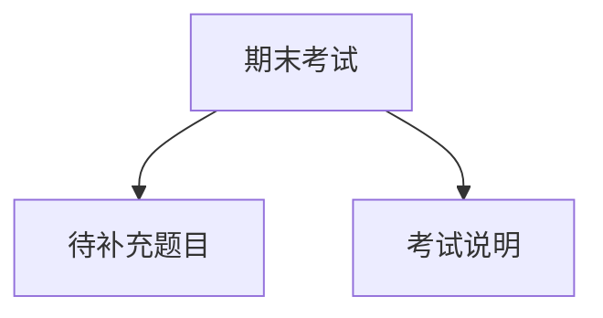

> [!summary] 考试摘要
> 本场[[博弈论]]第29次课为[[期末考试]]。教师首先向学生、学校和Substack社区致谢，宣布即将离开学校以扩展全球受众。考试内容待展开。

### 感谢与告别

> [!note] 致谢学生
> 首先感谢Alan和Vincent全年坚持上课。教师为偶尔发脾气致歉，但感激学生的提问与付出。

> [!note] 致谢学校
> 感谢学校提供的平台、教室和智能板。教师在此任教四年，可自由教授[[伟大著作]]、[[地缘策略]]、[[博弈论]]、[[秘密历史]]等课程。

> [!note] 致谢Substack社区
> 过去一年主要收入来自Substack，订阅者慷慨支持使得YouTube频道无广告、无赞助，专注于教学。
> 教师宣布将为创始会员和付费订阅者提供月度直播。未来将更多地扩展全球受众。

### 考试结构

